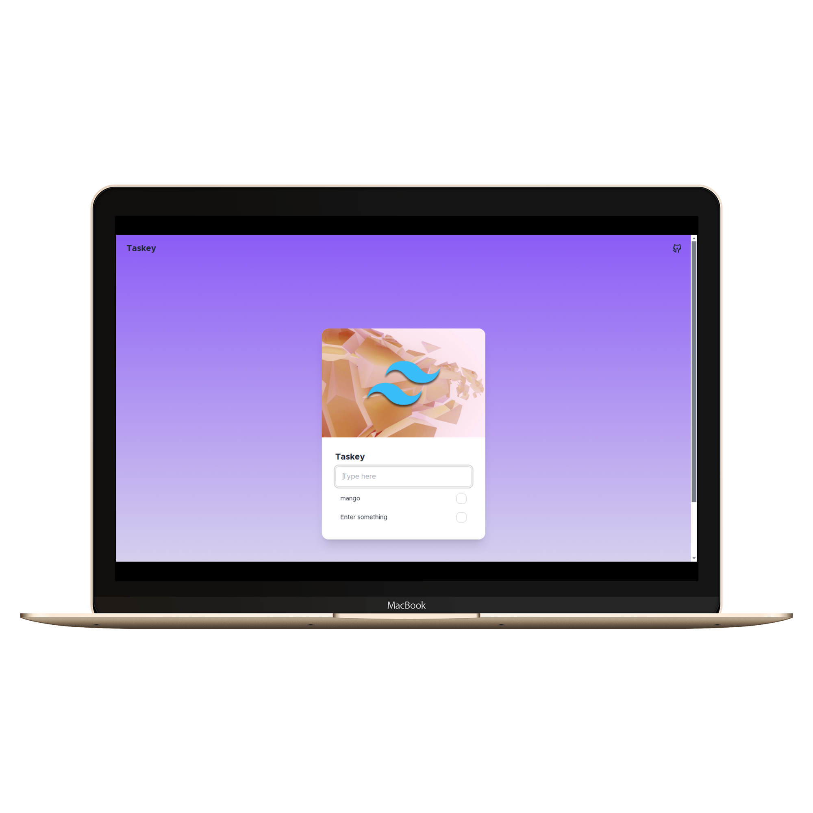

# Lineup



## Tailwind Setup

1. Scaffold a new vite vanilla project `pnpm init vite@latest .` command
2. Install tailwindcss
   `pnpm add -D tailwindcss postcss autoprefixer`

3. create setting files
   using: `pnpx tailwindcss init -p`

4. In your css file add the tailwind directives:
   `@tailwind base;` `@tailwind components;` `@tailwind utilities;`

5. pnpm install localforage

---

# DaisyUI Setup

1. Install daisyui
   `pnpm add -D daisyui`
2. Add this in your tailwind.config.js file

```js
module.exports = {
  content: ["./index.html", "./src/**/*.{js}"],
  theme: {
    extend: {},
  },
  plugins: [require("daisyui")],
};
```

1 :-
Example of Bubbling
In your code, if you click the button inside the div, both the button's click event and the div's click event will trigger, unless you prevent it using event.stopPropagation().

Here’s how it works:

The button is clicked.
The event triggers the one button's event listener (alert("button clicked")).
Then, the event "bubbles" up to the div element and triggers its click event listener (alert("div was clicked")).
Without event.stopPropagation(), both alerts would pop up in sequence.

2. Event Capturing :-If you add an event listener to the div with the capture phase enabled, it will fire before the button's click event, even though the button is the actual target.

javascript
Copy code

```js
box.addEventListener(
  "click",
  (event) => {
    alert("div was clicked during capturing phase");
  },
  true
); // third argument 'true' enables capturing
```

3. Event Delegation :- In your example, instead of adding an event listener directly to the button, you could use event delegation by attaching a listener to the parent div. Then, you can check if the event target is the button.

Example of Event Delegation
javascript
Copy code

```js
box.addEventListener("click", (event) => {
  if (event.target === one) {
    // event.target refers to the clicked element
    alert("Button clicked (via delegation)");
  } else {
    alert("Div was clicked");
  }
});
```
